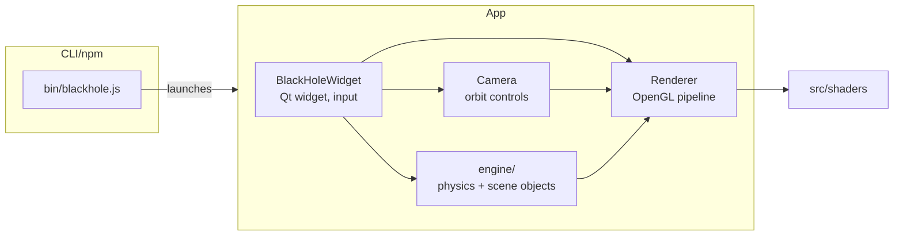

# Blackhole

## Why

Gravitational lensing near a black hole is hard to picture from equations alone. This project
renders it in real time — light bending, spin, and an accretion disk — so you can orbit a black
hole and see the physics instead of reading about it.

## Vision

- Real-time, physically-motivated gravitational lensing (not a pre-baked shader trick).
- Interactive camera so the effect can be explored, not just watched.
- Richer accretion-disk and spin visuals over time.
- Ship as an installable CLI/app (npm package wrapping a native macOS bundle) rather than a build-it-yourself repo.

## Architecture



- `Renderer` and `BlackHoleWidget` are the cross-cutting hubs — most other pieces talk through them
  ([graphify-out/GRAPH_REPORT.md](graphify-out/GRAPH_REPORT.md)).
- Lensing is a screen-space bent-ray technique against the scene's mass objects, in the spirit of
  [Riazuelo's gravitational lensing renderer](https://www.researchgate.net/publication/321286485).

## Plan

- [x] Working prototype with basic lensing.
- [x] Split simulation engine out of the renderer.
- [x] Spin, richer accretion-disk visuals.
- [ ] Multiple black holes / N-body scenes.
- [ ] Linux/Windows packaging (currently macOS only).
- [ ] Settings/params UI (mass, spin, disk, camera exposed to the user).
- [ ] Richer, more detailed visuals (beyond current disk shading).
- [ ] GPU-based rendering improvements.
- [ ] WASM export (run in-browser).

## Setup

Prerequisites: CMake 3.16+, Qt6 (Widgets, OpenGL, OpenGLWidgets), a C++20 compiler, Node.js (for the npm wrapper).

```bash
npm install
npm run dev      # debug build + run
npm run start     # release build + run
```

Package a distributable macOS bundle:

```bash
npm run build
npm run package
```
